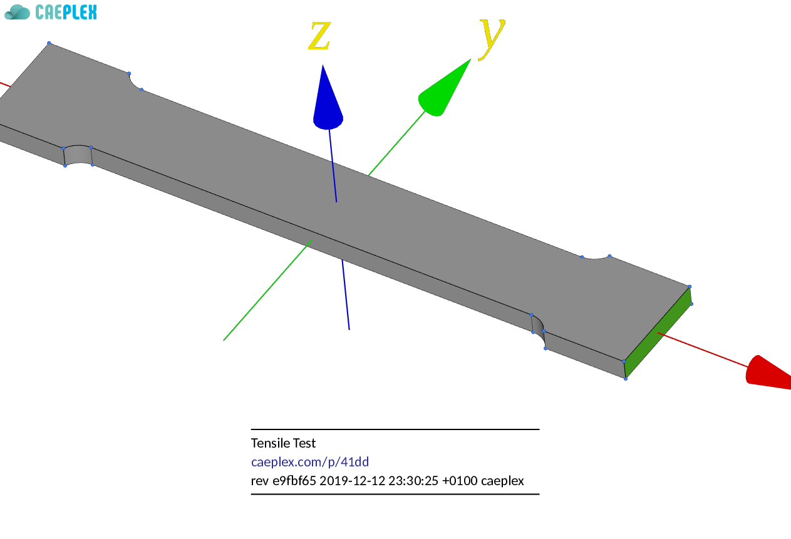
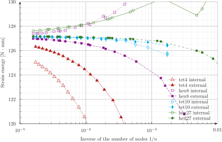

---
title: Fino, a free finite element solver
lang: en-US
...


:::{.text-center}


[Download Fino](https://www.seamplex.com/fino/install.html){.btn .btn-primary}
[Test cases](https://www.seamplex.com/fino/cases){.btn .btn-secondary}
[Reference sheet](https://www.seamplex.com/fino/reference.html){.btn .btn-info}
:::


# What

[Fino](https://www.seamplex.com/fino) is a [free](https://www.gnu.org/philosophy/free-sw.en.html) and [open source](https://opensource.com/resources/what-open-source) tool released under the terms of the [GPLv3+](#licensing) that uses the finite-element method to solve

 * steady or quasistatic thermo-mechanical problems, or
 * steady or transient heat conduction problems, or
 * modal analysis problems.

:::{.alert .alert-warning}
Please note that Fino is a [back end](https://en.wikipedia.org/wiki/Front_and_back_ends) aimed at advanced users. For an easy-to-use web-based front end with Fino running in the cloud directly from your browser see [CAEplex](https://www.caeplex.com) at <https://www.caeplex.com>.

::::: {.embed-responsive .embed-responsive-16by9 .mb-3}
 <iframe class="embed-responsive-item" src="https://www.youtube.com/embed/kD3tQdq17ZE" frameborder="0" allow="accelerometer; autoplay; encrypted-media; gyroscope; picture-in-picture" allowfullscreen></iframe>
:::::
:::

## Why

The world is already full of finite-element programs. However, almost every piece of FEA software falls in either one of these two categories:

 a. Powerful, flexible and complex advanced numerical solvers of general non-linear partial differential equations written by academics (for academics) distributed under the form of 
     i. libraries, which the user has to compile and link to their own codes, or
     ii. interpreted languages (i.e. Python) wrappers, which the user has to call from their own scripts, or
     iii. input-file reading binaries, which the user needs to fill in with the weak form of the equation they need to solve.
     
    **Examples:** [MoFEM](http://mofem.eng.gla.ac.uk/mofem/html/), [Sparselizard](http://sparselizard.org/), [GetDP](http://getdp.info/), [FEnICS](https://fenicsproject.org/), [MOOSE](https://mooseframework.org/), [FreeFEM](https://freefem.org/), ...  
     
 b. Commercial, non-free (well some of them are free but coded in FORTRAN 77 so the source is unintelligible) and complex GUI-based programs that are
     i. closed-source, so nobody can know what the actual equations are nor how they are solved, and/or
     ii. complicated, so the only way to use them is through their embedded mouse-based GUI, and/or
     iii. expensive and out of the league of many companies and professionals.
     
    **Examples:** [CalculiX](http://calculix.de/), [CodeAster](https://www.code-aster.org), [NASTRAN](https://github.com/nasa/NASTRAN-95)^[We list just the open-source ones because we [at Seamplex do not want to encourage the usage of non-free software](https://www.seamplex.com/mission.html#principles), but any of the commercial packages out there would also apply.] 
     
Hence, Fino tries to fill in the gap between these two worlds with a different design basis.^[Somewhat like [milonga](https://www.seamplex.com/milonga) although the landscape is slightly different.]
Read the foreword of the [tensile-test example](https://seamplex.com/fino/cases/000-tensile-test/) within the [case files](https://seamplex.com/fino/cases) for a deeper insight into Fino’s design and implementation philosophy.
     
## How

Fino...

 * is [free and open source software](#licensing). It is free as in “free speech,” it gives every user [the four essential freedoms](https://www.gnu.org/philosophy/free-sw.en.html) and its [source code is published as a Git repository](https://github.com/seamplex/fino).
 * reads an English-like input file with the problem definition. And here is the main thing: **simple problems ought to have simple inputs**.  See [the first example](#tensile-test) and the first cases in the [Fino case files](https://www.seamplex.com/fino/cases)
 * follows, among [others](https://www.seamplex.com/principles.html), the [UNIX philosophy](https://en.wikipedia.org/wiki/Unix_philosophy).
 * according to the UNIX rule of separation, leaves the pre and post-processing steps to software written by professional programmers in the CAD management, meshing and analysis fields. 
 * is written in plain [ANSI C](https://en.wikipedia.org/wiki/ANSI_C) (neither C++ nor Fortran) and uses state-of-the-art libraries and resources---such as [GNU Autotools](https://www.gnu.org/software/automake/manual/automake.html) and [PETSc](https://www.mcs.anl.gov/petsc/)---written by professional programmers. 
 * delegates all the grid management to [Gmsh](http://gmsh.info/) in a way that the input file Fino reads does not (necessarily) contain any reference to the mesh properties. In particular, this means that the very same Fino input file can be used to solve the same problem with different meshing schemes (shapes, sizes, optimizations, etc.).
 * can write [VTK](https://vtk.org/) files to be post-processed with [Paraview](https://www.paraview.org/) or other compatible tool. It can also write [MSH](http://gmsh.info/doc/texinfo/gmsh.html#MSH-file-format) files for post-processing with [Gmsh](http://gmsh.info/).
 * is particularly designed to handle complex dependence of material properties (i.e. temperature-dependent properties) and boundary conditions dependent on space over different geometric entities (i.e. volumes, faces, edges and/or vertices)---see the [thermal transient on a valve](#valve).
 * can perform parametric or optimization runs---see [the parametric cantilever study](#cantilever).


# Features

Fino uses a main input file (see below for [examples](#examples)), that in turn instructs Fino to read one or more mesh files in [Gmsh](http://gmsh.info/) format. Fino works on top of the [wasora framework](https://www.seamplex.com/wasora) so it shares its [design basis](https://www.seamplex.com/docs/SP-FI-17-BM-5460-A.pdf) and inherits all of its features:


  * evaluation of [algebraic expressions](https://www.seamplex.com/wasora/doc/realbook/002-expressions)
  * [one](https://www.seamplex.com/wasora/doc/realbook/007-functions) and [multi-dimensional](https://www.seamplex.com/wasora/doc/realbook/010-2dfunctions) function interpolation
  * [scalar](https://www.seamplex.com/wasora/doc/realbook/000-hello), [vector](https://www.seamplex.com/wasora/doc/realbook/006-fibonacci) and matrix operations
  * numerical [integration](https://www.seamplex.com/wasora/doc/realbook/008-integrals), [differentiation](https://www.seamplex.com/wasora/doc/realbook/012-mechanics) and root finding of functions
  * possibility to solve iterative and/or [time-dependent](https://www.seamplex.com/wasora/doc/realbook/003-lag) problems
  * adaptive [integration of systems of differential-algebraic equations](https://www.seamplex.com/wasora/realbook/real-018-waterwheel.html)
  * I/O from files and shared-memory objects (with optional synchronization using semaphores) for external coupling
  * execution of arbitrary code provided as shared object files
  * parametric runs using quasi-random sequence numbers to efficiently sweep a sub-space of parameter space 
  * solution of systems of non-linear algebraic equations
  * non-linear fit of scattered data to one or multidimensional functions
  * non-linear multidimensional optimization
  * management of unstructured grids, definition and operation of functions and smooth interpolation between meshes

Output is 100% defined in the input file. If no explicit output instruction is provided, Fino remains silent (as required by the [UNIX rule of silence](http://www.linfo.org/rule_of_silence.html)). Besides terminal and plain-text files (e.g. user-defined results in [JSON](https://en.wikipedia.org/wiki/JSON)), post-processing files in [VTK](http://www.cacr.caltech.edu/~slombey/asci/vtk/vtk_formats.simple.html) o [MSH](http://gmsh.info/doc/texinfo/gmsh.html#File-formats) formats can be generated.

# Examples

This section lists a few relevant examples.
See the [Fino cases list](https://www.seamplex.com/fino/cases) for a full list of annotated examples, verification cases and discussion of results.

 | 
 ------------------------------------------------------- | ------------ | ------------
| [Tensile test specimen](cases/000-tensile-test) | [ePub](cases/000-tensile-test.epub) | [PDF](cases/000-tensile-test.pdf) |
| [Cube under pure tension](cases/003-cube-pure-tension) | [ePub](cases/003-cube-pure-tension.epub) | [PDF](cases/003-cube-pure-tension.pdf) |
| [Cylinder under pure compression](cases/006-cylinder-pure-compression) | [ePub](cases/006-cylinder-pure-compression.epub) | [PDF](cases/006-cylinder-pure-compression.pdf) |
| [NAFEMS LE1 plane-stress benchmark](cases/010-nafems-le1) | [ePub](cases/010-nafems-le1.epub) | [PDF](cases/010-nafems-le1.pdf) |
| [NAFEMS LE10 thick plate pressure benchmark](cases/012-nafems-le10) | [ePub](cases/012-nafems-le10.epub) | [PDF](cases/012-nafems-le10.pdf) |
| [Stresses in a 10-node tetrahedron with prescribed displacements](cases/050-tet10) | [ePub](cases/050-tet10.epub) | [PDF](cases/050-tet10.pdf) |
| [The NAFEMS Benchmark Challenge\ &num;1](cases/060-nafems-challenge-problem1) | [ePub](cases/060-nafems-challenge-problem1.epub) | [PDF](cases/060-nafems-challenge-problem1.pdf) |
| [Four ways of solving three pressurized thick cylinders](cases/065-thick-cylinder) | [ePub](cases/065-thick-cylinder.epub) | [PDF](cases/065-thick-cylinder.pdf) |
| [Two cubes of different materials](cases/070-two-cubes) | [ePub](cases/070-two-cubes.epub) | [PDF](cases/070-two-cubes.pdf) |
| [Fixed compressed cylinder](cases/075-fixed-compressed-cylinder) | [ePub](cases/075-fixed-compressed-cylinder.epub) | [PDF](cases/075-fixed-compressed-cylinder.pdf) |
| [Thick cantilever cylinder](cases/085-cantilever-cylinder) | [ePub](cases/085-cantilever-cylinder.epub) | [PDF](cases/085-cantilever-cylinder.pdf) |
| [Cylinder embedded in another cylinder---smooth](cases/105-cyl-cyl-smooth) | [ePub](cases/105-cyl-cyl-smooth.epub) | [PDF](cases/105-cyl-cyl-smooth.pdf) |
| [Cylinder embedded in another cylinder---rough](cases/115-cyl-cyl-rough) | [ePub](cases/115-cyl-cyl-rough.epub) | [PDF](cases/115-cyl-cyl-rough.pdf) |


> All cases are published under the terms of the [Creative Commons Attribution 4.0 International License](http://creativecommons.org/licenses/by/4.0/).


## Tensile test 

Let us consider a tensile test specimen like [this one](https://caeplex.com/p/41dd1)


{.img-fluid}\ 


One end of the specimen is fixed and the other one has a tension load of 10 kN.
We would like to obtain the displacements and stresses distribution within the geometry.
Given that the problem is relatively simple, the input file [`examples/tensile-test.fin`](examples/tensile-test.fin) should also be rather simple:

```fino
# tensile test example for Fino, see https://caeplex.com/p/41dd1
MESH FILE_PATH tensile-test.msh  # mesh file in Gmsh format (either version 2.2 or 4)

# uniform properties given as scalar variables
E = 200e3   # [ MPa ] Young modulus = 200 GPa
nu = 0.3    # Poisson’s ratio

# boundary conditions ("left" and "right" come from the names in the mesh)
PHYSICAL_ENTITY left  BC fixed       # fixed end
PHYSICAL_ENTITY right BC Fx=1e4      # [ N ] load in x+

FINO_SOLVER PROGRESS_ASCII  # print ascii progress bars (optional) 
FINO_STEP                   # solve

# compute reaction force at fixed end
FINO_REACTION PHYSICAL_ENTITY left RESULT R

# write results (Von Mises, principal and displacements) in a VTK file
MESH_POST FILE_PATH tensile-test.vtk sigma sigma1 sigma2 sigma3 VECTOR u v w

# print some results (otherwise output will be null)
PRINT "displ_max = " %.3f displ_max "mm"
PRINT "sigma_max = " %.1f sigma_max "MPa"
PRINT "principal1 at center = " %.8f sigma1(0,0,0) "MPa"
PRINT "reaction  = [" %.3e R "] Newtons"
```

If we ran this example from a terminal, we would get something like this:

```terminal
$ fino tensile-test.fin
....................................................................................................
----------------------------------------------------------------------------------------------------
====================================================================================================
displ_max =     0.076   mm
sigma_max =     160.5   MPa
principal1 at center =  99.99948213     MPa
reaction  = [   -1.000e+04      1.622e-03       6.226e-03       ] Newtons
$
```

The output can be post-processed with the free tool [ParaView](http://www.paraview.org/):

{.img-fluid #fig:tensile-vtk}\ 


See the full [tensile-test example](https://seamplex.com/fino/cases/000-tensile-test/) within the [case files](https://seamplex.com/fino/cases) for further details and a thorough discussion.


## Parametric beam {#cantilever}

This example is far more complex as it studies the shear-locking effect of first order elements under bending loads of a square-section cantilevered beam. It computes how displacements compares to second-order elements and how they depend on mesh size and structure. Hence, the input file is also more complex. 

```{=html}
<p class="mt-2"><a class="btn btn-primary" data-toggle="collapse" href="#input_cantilever">Show input file</a></p>
<div class="collapse" id="input_cantilever">
<div class="card card-body">
```

```fino
DEFAULT_ARGUMENT_VALUE 1 1        # use first (1) or second (2) order elements
DEFAULT_ARGUMENT_VALUE 2 0        # use structured (1) or unstructured (0) tets
DEFAULT_ARGUMENT_VALUE 3 5        # number of elements along h

h = 10   # beam width and height
l = 50   # beam length

PARAMETRIC n MIN 2 MAX $3 STEP 1
n = 2

OUTPUT_FILE geo  cantilever-$1-$2-%g.geo n
M4 {
 INPUT_FILE_PATH  cantilever.geo.m4
 OUTPUT_FILE geo
 MACRO h      h
 MACRO l      l
 MACRO lc     $1*h/n
 MACRO order  $1
 MACRO struct $2
}

SHELL "gmsh -v 0 -3 cantilever-$1-$2-%g.geo" n

INPUT_FILE mesh cantilever-$1-$2-%g.msh n
MESH FILE mesh DIMENSIONS 3

P = 1000   # load in [ N ]
E = 200e3  # Young modulus in [ MPa ]
nu = 0.3   # Poisson’s ratio

PHYSICAL_ENTITY NAME bulk
PHYSICAL_ENTITY NAME left  BC fixed
PHYSICAL_ENTITY NAME right BC Fz=-1000


FINO_STEP

# energy_density(x,y,z) := 0.5*{( 
#  sigmax(x,y,z)*dudx(x,y,z) +
#  sigmay(x,y,z)*dvdy(x,y,z) +
#  sigmaz(x,y,z)*dwdz(x,y,z) +
#  tauxy(x,y,z)*(dudy(x,y,z) + dvdx(x,y,z)) +
#  tauyz(x,y,z)*(dvdz(x,y,z) + dwdy(x,y,z)) +
#  tauzx(x,y,z)*(dwdx(x,y,z) + dudz(x,y,z))
# )}
# MESH_INTEGRATE FUNCTION energy_density OVER bulk RESULT integrated_energy

FINO_REACTION PHYSICAL_ENTITY left RESULT R

# reference max deflection according to Euler-Bernoulli
# https://en.wikipedia.org/wiki/Euler%E2%80%93Bernoulli_beam_theory#Cantilever_beams
wc = P*l^3/(3*E*(h^4)/12)

PRINT %.3e 1/nodes %g n nodes elements \
      %.5g -w(l,0,0) wc sigma_max \
      %.3f time_cpu_build time_cpu_solve time_cpu_stress %.0f memory/1e6 \
      %g R(3) strain_energy #integrated_energy

OUTPUT_FILE vtk cantilever-$1-$2-%g.vtk n
MESH_POST FILE vtk sigma sigma1 sigma2 sigma3 VECTOR u v w sigma
```

```{=html}
</div>
</div>
```

{.img-fluid width=100% #fig:cantilever-displ}

{.img-fluid width=100% #fig:cantilever-energy}


## Thermal conduction in a piston engine

Problem taken from [Simscale’s thermal tutorial](https://www.simscale.com/docs/content/tutorials/tutorial_heat-transfer.html):

```{=html}
<p class="mt-2"><a class="btn btn-primary" data-toggle="collapse" href="#input_piston">Show input file</a></p>
<div class="collapse" id="input_piston">
<div class="card card-body">
```


```fino
# thermal conductivity in an engine piston as in
# https://www.simscale.com/docs/content/tutorials/tutorial_heat-transfer.html

SHELL "if [ ! -e piston.msh ]; then gmsh -v 0 -3 piston.geo; fi"
MESH FILE_PATH piston.msh        # the mesh is in mm
FINO_PROBLEM HEAT DIMENSIONS 3

f = 1e-3   # factor to convert from m to mm
# thermal conductivity numerically in W/(m*K) converted to W/(mm*K)
k = 160*f

# heat transfer coefficient in W/(m^2*K) converted to W/(mm^2*K)
# note that the names contain spaces so they must be quoted
PHYSICAL_ENTITY "top"                BC   h=450*f^2   Tref=1400
PHYSICAL_ENTITY "ring 1"             BC   h=150*f^2   Tref=450
PHYSICAL_ENTITY "ring 1 groove"      BC   h=1e3*f^2   Tref=450
PHYSICAL_ENTITY "ring 2"             BC   h=150*f^2   Tref=450
PHYSICAL_ENTITY "ring 2 groove"      BC   h=400*f^2   Tref=380
PHYSICAL_ENTITY "ring 3"             BC   h=150*f^2   Tref=380
PHYSICAL_ENTITY "ring 3 groove"      BC   h=400*f^2   Tref=380
PHYSICAL_ENTITY "interior and skirt" BC   h=650*f^2   Tref=380

FINO_STEP

MESH_POST FILE_PATH piston-temp.vtk T
MESH_POST FILE_PATH piston-temp.msh T

PRINT "\# cpu time [sec] = "  %.2f time_cpu_build "(build) "  time_cpu_solve "(solve)"  SEP " "
PRINT "\# memory [Mb]    = "  %.0f memory/1024^2
PRINT %.0f T(0,0,0)
```

```{=html}
</div>
</div>
```

{.img-fluid #fig:engine-piston}

{.img-fluid #fig:piston-simscale}


## Transient heat conduction on a valve {#valve}

Thermal conduction on a multi-material valve plus nozzle set with temperature-dependent properties and time-dependent boundary conditions.

```{=html}
<div class="embed-responsive embed-responsive-16by9">
 <video width="100%" height="100%" controls>
  <source src="examples/temp-valve-smooth.mp4" type="video/mp4">
  <source src="examples/temp-valve-smooth.mkv" type="video/mkv">
  <source src="examples/temp-valve-smooth.webm" type="video/webm">
 </video> 
</div> 
```

```{=html}
<p class="mt-2"><a class="btn btn-primary" data-toggle="collapse" href="#input_piston">Show input file</a></p>
<div class="collapse" id="input_piston">
<div class="card card-body">
```

```fino
MESH FILE_PATH valve.msh DIMENSIONS 3
FINO_PROBLEM thermal

FUNCTION Tref(t) DATA {
 0    50
 10   50
 50   320
 60   300
 90   150
 120  320
 150  320
}

static_steps = 3
end_time = Tref_b

PHYSICAL_ENTITY NAME internal  BC T=Tref(t)
PHYSICAL_ENTITY NAME external  BC h=1e-6      Tref=50
PHYSICAL_ENTITY NAME symmetry  BC q=0

FUNCTION k_carbon(temp) INTERPOLATION steffen DATA {
      20             11.5
      50             12.0
      75             12.3
     100             12.7
     125             12.9
     150             13.2
     175             13.5
     200             13.8
     225             14.0
     250             14.3
     275             14.6
     300             14.9
     325             15.1
     350             15.4
}

FUNCTION kappa_carbon(temp) INTERPOLATION steffen DATA {
      20             11.5
      50             11.8
      75             11.9
     100             12.1
     125             12.3
     150             12.4
     175             12.6
     200             12.7
     225             12.9
     250             13.0
     275             13.2
     300             13.3
     325             13.4
     350             13.6
}

FUNCTION k_ss(temp) INTERPOLATION steffen DATA {
   20     14.8
   50     15.3
   75     15.8
  100     16.2
  125     16.6
  150     17.0
  175     17.5
  200     17.9
  225     18.3
  250     18.6
  275     19.0
  300     19.4
  325     19.8
  350     20.1
}

FUNCTION kappa_ss(temp) INTERPOLATION steffen DATA {
   20      3.90
   50      3.94
   75      3.99
  100      4.04
  125      4.08
  150      4.14
  175      4.19
  200      4.24
  225      4.30
  250      4.35
  275      4.41
  300      4.46
  325      4.52
  350      4.57
}


MATERIAL carbon {
  k       k_carbon(T(x,y,z))*1e-3      # it is in W/(m K) and we need it in W/(mm K)
  kappa   kappa_carbon(T(x,y,z))       # it is in 1e-6 m^2/S and we need it in mm^2/s
}

MATERIAL stainless {
  k       0.2*k_ss(T(x,y,z))*1e-3      # one-fifth to exaggerate the effects
  kappa   kappa_ss(T(x,y,z))
}

# advance one step
FINO_STEP

IF done_static
 ro = 57
 ri = ro-8.5
 PRINT %g t %.3f Tref(t) {
  T(+1,0,ri)
  T(+1,0,0.5*(ri+ro))
  T(+1,0,ro)
  T(-1,0,ri)
  T(-1,0,0.5*(ri+ro))
  T(-1,0,ro)
 }
 MESH_POST FILE_PATH temp-valve.msh T
ENDIF
```

```{=html}
</div>
</div>
```

## Modal analysis of a piping systems

 * <https://caeplex.com/project/results.php?id=42180c>

```{=html}
<div class="embed-responsive embed-responsive-16by9">
 <video width="100%" height="100%" controls>
  <source src="examples/mode5.mp4" type="video/mp4">
  <source src="examples/mode5.mkv" type="video/mkv">
  <source src="examples/mode5.webm" type="video/webm">
 </video> 
</div> 
```

```{=html}
<div class="embed-responsive embed-responsive-16by9">
 <video width="100%" height="100%" controls>
  <source src="examples/mode6.mp4" type="video/mp4">
  <source src="examples/mode6.mkv" type="video/mkv">
  <source src="examples/mode6.webm" type="video/webm">
 </video> 
</div> 
```

```{=html}
<div class="embed-responsive embed-responsive-16by9">
 <video width="100%" height="100%" controls>
  <source src="examples/mode7.mp4" type="video/mp4">
  <source src="examples/mode7.mkv" type="video/mkv">
  <source src="examples/mode7.webm" type="video/webm">
 </video> 
</div> 
```


## Thermal expansion of finite cylinders

 * <https://www.seamplex.com/docs/SP-FI-17-BM-5460-A.pdf>
 * <https://www.caeplex.com/project/results.php?id=118237faf0>.

```{=html}
<div class="embed-responsive embed-responsive-16by9">
  <iframe class="embed-responsive-item" style="border: 0" src="https://www.caeplex.com/project/results.php?id=118237faf0&embed"></iframe>
</div> 
```

```{=html}
<p class="mt-2"><a class="btn btn-primary" data-toggle="collapse" href="#input_veeder">Show input file</a></p>
<div class="collapse" id="input_veeder">
<div class="card card-body">
```

```fino
# solves the benchmark problem by J. Veeder
# Thermo-elastic expansion of finite cylinders, AECL-2660, 1967

r = 20   # cylinder radius
H = 20   # cylinder height 
lc = 5   # characteristic length of the mesh

# mesh
M4 INPUT_FILE_PATH veeder.geo.m4 OUTPUT_FILE_PATH veeder.geo EXPAND lc EXPAND r EXPAND H
SHELL "gmsh -3 -v 0 -order 2 veeder.geo"
MESH FILE_PATH veeder.msh DIMENSIONS 3

FINO_PROBLEM mechanical

E = 200e3     # young modulus (does not matter for the displacement, only for stresses)
nu = 0.25     # poisson ratio
alpha = 1e-5  # temperature expansion coefficient

# temperature distribution
T0 = 400-20
T(x,y,z) := T0*(1-(x^2+y^2)/(r^2))

# boundary conditions (note that the cylinder can still expand on the x-y plane)
PHYSICAL_GROUP NAME inf      BC tangential radial x0=0 y0=0 z0=0

# solve!
FINO_STEP

# write vtk output
MESH_POST FILE_PATH veeder.vtk      T sigma dudx dudy dudz dvdx dvdy dvdz dwdx dwdy dwdz  sigma1 sigma2 sigma3  VECTOR u v w

# displacement profiles 
v_profile(z') := v(0, r, z'*H/2)/(alpha*T0*r)
w_profile(y') := w(0, r*y', H/2)/(alpha*T0*r)

PRINT_FUNCTION FILE_PATH veeder_v.dat FORMAT %.3f v_profile MIN 0 MAX 1 NSTEPS 50 HEADER
PRINT_FUNCTION FILE_PATH veeder_w.dat FORMAT %.3f w_profile MIN 0 MAX 1 NSTEPS 50 HEADER

# screen output
PRINT "\# max_displacement" displ_max TEXT "at" displ_max_x displ_max_y displ_max_z
PRINT "\# see veeder_v.dat and veeder_w.dat for the non-dimensional displacement profiles along the axes"
PRINT "\# cpu time [sec] = "  %.2f time_cpu_build "(build) "  %.2f time_cpu_solve "(solve)"  SEP " "
PRINT "\# memory [Gb]    = "  %.2f memory_usage_global/1e9 TEXT "/" available_memory/1e9  SEP " "

PRINT sigma(0,0,0) sigma1(0,0,0) sigma2(0,0,0) sigma3(0,0,0)
```

```{=html}
</div>
</div>
```

{.img-fluid #fig:veeder}


# Licensing

Fino is distributed under the terms of the [GNU General Public License](http://www.gnu.org/copyleft/gpl.html) version 3 or (at your option) any later version. The following text was borrowed from the [Gmsh documentation](http://gmsh.info/doc/texinfo/gmsh.html#Copying-conditions). Replacing “Gmsh” with “Fino” gives:

::: {.alert .alert-light}
Fino is “free software”; this means that everyone is free to use it and to redistribute it on a free basis. Fino is not in the public domain; it is copyrighted and there are restrictions on its distribution, but these restrictions are designed to permit everything that a good cooperating citizen would want to do. What is not allowed is to try to prevent others from further sharing any version of Fino that they might get from you.

Specifically, we want to make sure that you have the right to give away copies of Fino, that you receive source code or else can get it if you want it, that you can change Fino or use pieces of Fino in new free programs, and that you know you can do these things.

To make sure that everyone has such rights, we have to forbid you to deprive anyone else of these rights. For example, if you distribute copies of Fino, you must give the recipients all the rights that you have. You must make sure that they, too, receive or can get the source code. And you must tell them their rights.

Also, for our own protection, we must make certain that everyone finds out that there is no warranty for Fino. If Fino is modified by someone else and passed on, we want their recipients to know that what they have is not what we distributed, so that any problems introduced by others will not reflect on our reputation.

The precise conditions of the license for Fino are found in the [General Public License](https://github.com/seamplex/fino/blob/master/COPYING) that accompanies the source code. Further information about this license is available from the GNU Project webpage <http://www.gnu.org/copyleft/gpl-faq.html>.
:::

# Further information

Home page: <https://www.seamplex.com/fino>  
Repository: <https://github.com/seamplex/fino.git>  
Mailing list and bug reports: <wasora@seamplex.com>  (you need to subscribe first at <wasora+subscribe@seamplex.com>)  
Web interface for mailing list: <https://www.seamplex.com/lists.html>  
Follow us: [Twitter](https://twitter.com/seamplex/) [YouTube](https://www.youtube.com/channel/UCC6SzVLxO8h6j5rLlfCQPhA) [LinkedIn](https://www.linkedin.com/company/seamplex/) [Github](https://github.com/seamplex)

---------------------------

Fino is copyright ©2014-2020 [Seamplex](https://www.seamplex.com)  
Fino is licensed under [GNU GPL version 3](http://www.gnu.org/copyleft/gpl.html) or (at your option) any later version.  
Fino is free software: you are free to change and redistribute it.  
There is NO WARRANTY, to the extent permitted by law.  
See the [copying conditions](COPYING).  
