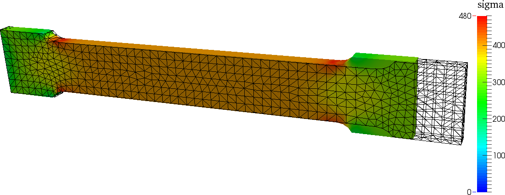
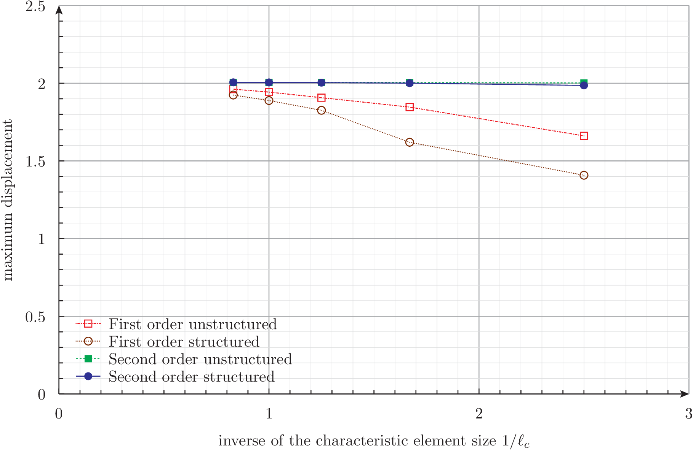
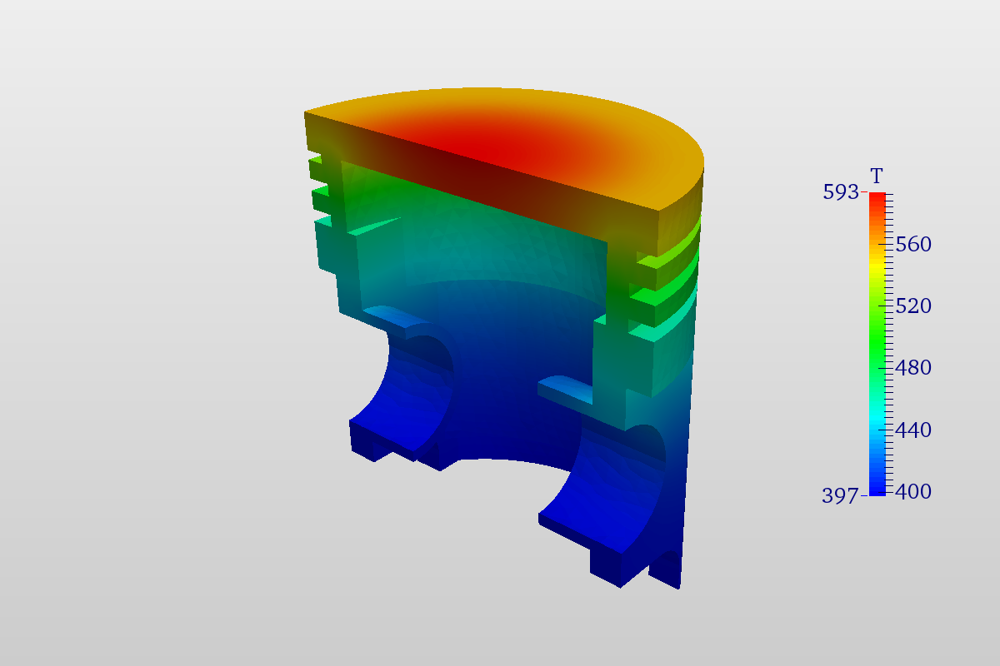
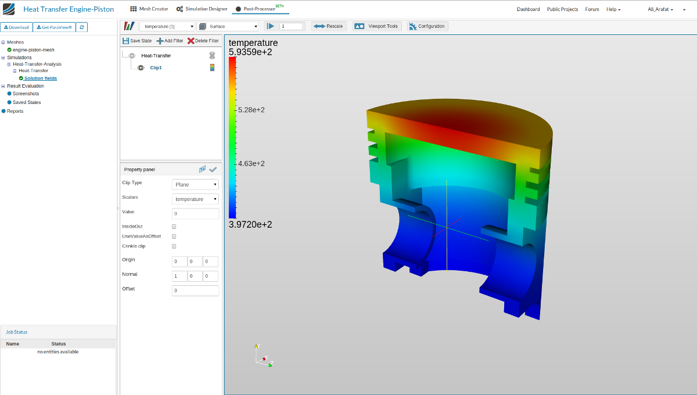
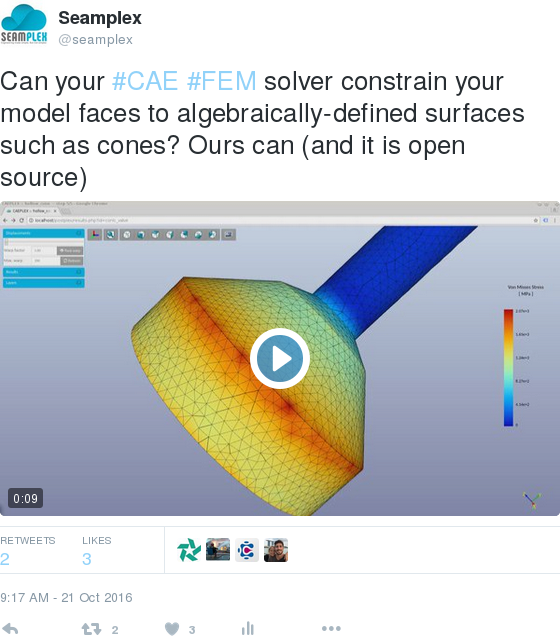
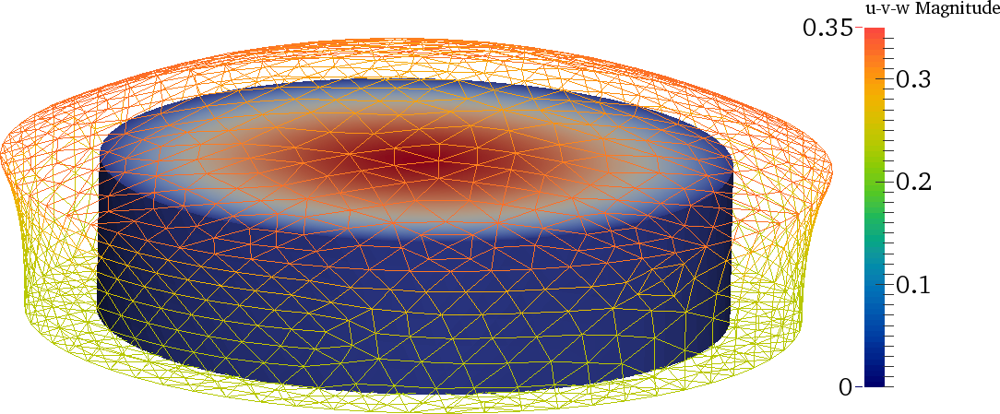

% Fino: FINite elements Optimization

{.img-responsive}\ 


[Fino](https://www.seamplex.com/fino) is a free and open source tool to solve partial differential equations using the finite element method. It is particularly designed to handle complex material properties, parametric and optimization runs while solving linear elastic problems, natural frequency analysis and heat conduction but arbitrary equations may be included. The domain over which the PDE is solved (which can be either one, two or three-dimensional) should be a grid generated by [Gmsh](http://geuz.org/gmsh/). The material properties (i.e. the coefficients of the PDE) may involve arbitrary dependence of space associated to volumetric physical entities defined in the mesh. Dirichlet, Neumann and/or Robin boundary conditions can be given as algebraic functions of space and are also associated to surface physical entities.

Fino follows, amongst [others](https://www.seamplex.com/principles.html), the [UNIX philosophy](https://en.wikipedia.org/wiki/Unix_philosophy). Fino is a back-end aimed at advanced users. For a web-based fronted with Fino running on the cloud, see [CAEplex](https://www.caeplex.com)

[{.img-responsive}](https://www.caeplex.com)

<section id="demo">
<div class="container container-section">
<div class="row hidden-xs" style="margin-top: 1em">
<div class="col-md-12">
<div class="embed-responsive embed-responsive-16by9">
<div class="github-fork-ribbon right-top" title="Play with me!"></div>
<iframe class="embed-responsive-item" src="https://www.caeplex.com/project_results_view.php?id=140f1b561469d302f4b3eb3690f95284&embed"></iframe>
</div>
</div>
</div>
<div class="row hidden-sm hidden-md hidden-lg" style="margin-top: 1em">
<div class="col-xs-12 text-center">
<a href="demo" target="_blank"></a>
<small>Should you open this page with a larger viewport, you might be able to play with the CAEplex project above.</small>
</div>
</div>
</div>
</section>

# Quick start

If you are impatient to run Fino, open a terminal in any GNU/Linux box (may be a VirtualBox box) and run:

```
sudo apt-get install curl m4 make autoconf automake gcc git libgsl0-dev wget findutils
curl https://www.seamplex.com/fino/get.sh | sh
```

You might need to use a different package manager if your distribution is not [Debian](http://www.debian.org)-based.
If you are behind a proxy, make sure that both `http_proxy` and `https_proxy` are properly set. If you get any error, either

 a. See the detailed explanation in [INSTALL](INSTALL.md)  
 b. Ask for help in the mailing list at <https://groups.google.com/a/seamplex.com/forum/#!forum/wasora>

Should you want to directly clone the repository, knock yourself out with:

```
git clone https://bitbucket.org/seamplex/fino
```

If these instructions are non-sense to you, go directly to point (b) above.


# Features 

Fino uses the a finite-element formulation to solve

 * the displacement-based linear static elastic problem, or
 * the natural frequencies modal linear static elastic problem, or
 * the static heat conduction equation, or
 * any arbitrary linear partial differential equation provided the user enters the elemental stiffness matrix.

Fino uses a main input file (see below for [examples](#examples)), that in turn instructs Fino to read one or more mesh files in [Gmsh](http://gmsh.info/) format. Fino works on top of the [wasora framework](https://www.seamplex.com/wasora) so it shares its [design basis](https://www.seamplex.com/docs/SP-FI-17-BM-5460-A.pdf) and inherits all of its features:


  * evaluation of [algebraic expressions](https://www.seamplex.com/wasora/realbook/real-002-expressions.html)
  * [one](https://www.seamplex.com/wasora/realbook/real-007-functions.html) and [multi-dimensional](https://www.seamplex.com/wasora/realbook/real-010-2dfunctions.html) function interpolation
  * [scalar](https://www.seamplex.com/wasora/realbook/real-001-peano.html), [vector](https://www.seamplex.com/wasora/realbook/real-006-fibonacci.html) and matrix operations
  * numerical [integration](https://www.seamplex.com/wasora/realbook/real-008-integrals.html), [differentiation](https://www.seamplex.com/wasora/realbook/real-017-double-pendulum.html) and [root finding](https://www.seamplex.com/wasora/realbook/real-020-gsl.html) of functions
  * possibility to solve [iterative](https://www.seamplex.com/wasora/realbook/real-030-buffon.html) and/or [time-dependent](https://www.seamplex.com/wasora/realbook/real-003-lag.html) problems
  * adaptive [integration of systems of differential-algebraic equations](https://www.seamplex.com/wasora/realbook/real-018-waterwheel.html)
  * I/O from files and shared-memory objects (with optional synchronization using semaphores)
  * execution of [arbitrary code](https://www.seamplex.com/wasora/realbook/real-015-primes) provided as shared object files
  * [parametric runs using quasi-random sequence numbers](https://www.seamplex.com/wasora/realbook/real-025-mathace.html) to efficiently sweep a sub-space of parameter space 
  * solution of systems of non-linear algebraic equations
  * non-linear fit of scattered data to [one](https://www.seamplex.com/wasora/realbook/real-020-gsl.html) or [multidimensional](https://www.seamplex.com/wasora/realbook/real-028-mass.html) functions
  * [non-linear multidimensional optimization](https://www.seamplex.com/wasora/realbook/real-020-gsl.html)
  * management of unstructured grids

Output is 100% defined in the input file. If no explicit output instruction is provided, Fino remains silent (as required by the [UNIX rule of silence](http://www.linfo.org/rule_of_silence.html)). Besides terminal and plain-text files, post-processing files in VTK o MSH formats can be generated.

# Examples

See the directory `examples` for further cases.


## Tensile test 

Let us consider the example input file [`examples/tensile-test.fin`](examples/tensile-test.fin):

```wasora
MESH FILE_PATH tensile-test-specimen.msh   # mesh file in Gmsh format

# uniform properties
E = 2e5   # Young modulus
nu = 0.3  # Poisson ratio

# boundary conditions (the names come from the physical entities in the mesh)
PHYSICAL_ENTITY NAME left  BC fixed
PHYSICAL_ENTITY NAME right BC tx=0.002*E*(10/13)   # traction
# PHYSICAL_ENTITY NAME right BC u=0 v=0 w=1        # displacement

# print some data
PRINT TEXT "elements                    =" %g elements
PRINT TEXT "nodes                       =" %g nodes

FINO_STEP

# results
MESH_POST FILE_PATH tensile-test.vtk sigma sigma1 sigma2 sigma3 VECTOR u v w

PRINT TEXT "maximum_diplacement   [mm]  =" %g displ_max
PRINT TEXT "stress_at_the_origin  [MPa] =" %g sigma(0,0,0)
PRINT TEXT "reaction_at_fixed_end [N]   =" %g TEXT "Rx ="  R_left_x TEXT "Ry =" R_left_y TEXT "Rz =" R_left_z
PRINT FILE_PATH tensile-sigma.dat %.0f sigma(0,0,0)
```

We can run it with Fino like this:

```bash
$ fino tensile-test.fin 
elements                    =   3356
nodes                       =   1178
maximum_diplacement   [mm]  =   0.30163
stress_at_the_origin  [MPa] =   399.999
reaction_at_fixed_end [N]   =   Rx =    -40000  Ry =    8.99532e-09     Rz =    -8.00355e-11
$ 
```

We can process the `VTK` output file with the free tool [ParaView](http://www.paraview.org/):

{.img-responsive}


## Cantilever beam with first & second order elements

```wasora
DEFAULT_ARGUMENT_VALUE 1 1        # use first (1) or second (2) order elements
DEFAULT_ARGUMENT_VALUE 2 0        # use structured (1) or unstructured (0) tets

PARAMETRIC c MIN 0.4 MAX 1.2 NSTEPS 5

OUTPUT_FILE geo  cantilever-$1-$2-%.2f.geo c
M4 {
 INPUT_FILE_PATH  cantilever.geo.m4
 OUTPUT_FILE geo
 MACRO lc     $1/c
 MACRO struct $2
}

SHELL "if [ ! -e cantilever-$1-$2-%.2f.msh ]; then gmsh -v 0 -3 -order $1 cantilever-$1-$2-%.2f.geo > /dev/null; fi" c c
INPUT_FILE mesh cantilever-$1-$2-%.2f.msh c
MESH FILE mesh DIMENSIONS 3

PHYSICAL_ENTITY NAME left  BC fixed
PHYSICAL_ENTITY NAME right BC Tz=-1000

E = 200e3
nu = 0.3

FINO_STEP

PRINT %.2f 1/c c %g nodes elements %.5g displ_max sigma_max %g fino_iterations %.2f time_cpu_build time_cpu_solve %.0f memory_usage_global/1e6

OUTPUT_FILE vtk cantilever-$1-$2-%.2f.vtk c
MESH_POST FILE vtk sigma sigma1 sigma2 sigma3 VECTOR u v w
```

{.img-responsive}


## Thermal conduction in a piston engine

Problem taken from [Simscale’s thermal tutorial](https://www.simscale.com/docs/content/tutorials/tutorial_heat-transfer.html):


```wasora
# thermal conductivity in an engine piston as in
# https://www.simscale.com/docs/content/tutorials/tutorial_heat-transfer.html

SHELL "if [ ! -e engine-piston.msh ]; then gmsh -v 0 -3 engine-piston.geo; fi"
MESH FILE_PATH engine-piston.msh  # the mesh is in mm
FINO_PROBLEM BAKE DIMENSIONS 3

f = 1e-3   # factor to convert from m to mm
# thermal conductivity numerically in W/(m*K) set in W/(mm*K)
k = 160*f

# heat transfer coefficient in W/(m^2*K) set in W/(mm^2*K)
PHYSICAL_ENTITY NAME "top"                BC   h=450*f^2   Tref=1400
PHYSICAL_ENTITY NAME "ring 1"             BC   h=150*f^2   Tref=450
PHYSICAL_ENTITY NAME "ring 1 groove"      BC  h=1000*f^2   Tref=450
PHYSICAL_ENTITY NAME "ring 2"             BC   h=150*f^2   Tref=450
PHYSICAL_ENTITY NAME "ring 2 groove"      BC   h=400*f^2   Tref=380
PHYSICAL_ENTITY NAME "ring 3"             BC   h=150*f^2   Tref=380
PHYSICAL_ENTITY NAME "ring 3 groove"      BC   h=400*f^2   Tref=380
PHYSICAL_ENTITY NAME "interior and skirt" BC   h=650*f^2   Tref=380

FINO_STEP

MESH_POST FILE_PATH engine-piston.vtk T

# PRINT "\# cpu time [sec] = "  %.2f time_cpu_build "(build) "  %.2f time_cpu_solve "(solve)"  SEP " "
PRINT %.1f T(0,0,0)

```

{.img-responsive}

{.img-responsive}


## Conic valve

Can your solver constrain your model faces to algebraically-defined surfaces such as cones? Ours can (and it is open source):

[{.img-responsive}](https://twitter.com/seamplex/status/789440535329181696)\ 

```wasora
SHELL "gmsh -v 0 -3 conic_valve.geo"
MESH FILE_PATH conic_valve.msh DIMENSIONS 3

E = 200e3
nu = 0.3

FINO_SOLVER PC_TYPE lu KSP_TYPE gmres

PHYSICAL_ENTITY NAME base  BC u=0 v=1e-2 w=0
PHYSICAL_ENTITY NAME top   BC u=0 v=1e-2 w=0

# the cone equation
x1 = -4
y1 = 2

x2 = -2
y2 = 4

f(x) := (y2-y1)/(x2-x1)*(x-x1) + y1
h = f(0)
r = root(f(x), x, -10, 0) 

PHYSICAL_ENTITY NAME cone  BC implicit=((x+u)^2+(z+w)^2)/(r/h)^2-(y+v-h)^2

FINO_STEP
MESH_POST FILE_PATH conic_valve.vtk sigma VECTOR u v w dudx dvdx dwdx dudy dvdy dwdy dudz dvdz dwdz 
```

See the original tweet at <https://twitter.com/seamplex/status/789440535329181696>

## Thermal expansion of finite cylinders

{.img-responsive}


See <https://www.seamplex.com/docs/SP-FI-17-BM-5460-A.pdf>.

# Licensing

Fino is distributed under the terms of the [GNU General Public License](http://www.gnu.org/copyleft/gpl.html) version 3 or (at your option) any later version.


# Further information

Home page: <https://www.seamplex.com/fino>  
Repository: <https://bitbucket.org/seamplex/fino>  
Mailing list and bug reports: <wasora@seamplex.com>  (you need to subscribe first at <wasora+subscribe@seamplex.com>)  
Web interface for mailing list: <https://www.seamplex.com/lists.html>  
Follow us: [Twitter](https://twitter.com/seamplex/) [YouTube](https://www.youtube.com/channel/UCC6SzVLxO8h6j5rLlfCQPhA) [LinkedIn](https://www.linkedin.com/company/seamplex/) [Bitbucket](https://bitbucket.org/seamplex/)

---------------------------

fino is copyright (C) 2014-2017 Jeremy Theler  
fino is licensed under [GNU GPL version 3](http://www.gnu.org/copyleft/gpl.html) or (at your option) any later version.  
fino is free software: you are free to change and redistribute it.  
There is NO WARRANTY, to the extent permitted by law.  
See the file `COPYING` for copying conditions.  
