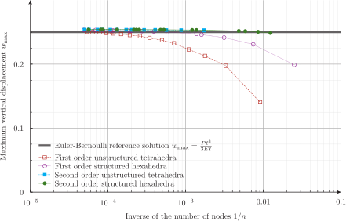

---
title: Fino, a free finite element solver
lang: en-US
...

{.img-fluid}\ 

[Fino](https://www.seamplex.com/fino) is a free and open source tool that uses the finite-element method to solve

 * steady-state thermo-mechanical problems, or
 * steady or transient heat conduction problems, or
 * modal analysis problems.

It is particularly designed to handle complex dependence of material properties (i.e. temperature-dependent properties). It can also perform parametric or optimization runs. The domain over which the problem is solved should be a grid generated by [Gmsh](http://gmsh.info/). The material properties and boundary conditions may involve arbitrary dependence of space associated to physical entities defined in the mesh. 

Fino follows, amongst [others](https://www.seamplex.com/principles.html), the [UNIX philosophy](https://en.wikipedia.org/wiki/Unix_philosophy). Fino is a [back-end](https://en.wikipedia.org/wiki/Front_and_back_ends) aimed at advanced users. For an easy-to-use web-based front-end with Fino running in the cloud, see [CAEplex](https://www.caeplex.com):

::: {.embed-responsive .embed-responsive-16by9 .mb-3}
 <iframe class="embed-responsive-item" src="https://www.youtube.com/embed/uvzzPyRYk_c" frameborder="0" allow="accelerometer; autoplay; encrypted-media; gyroscope; picture-in-picture" allowfullscreen></iframe>
:::

# Quick start

:::{.alert .alert-light}
> “It is really worth any amount of time and effort to get away from Windows if you are doing computational science.”
>
> [<https://lists.mcs.anl.gov/pipermail/petsc-users/2015-July/026388.html>]{.blockquote-footer}
:::

Open a terminal in a GNU/Linux box (may be a VirtualBox box) and install the following tools and libraries:

~~~
sudo apt-get install m4 make autoconf automake gcc g++ git findutils
sudo apt-get install libgsl-dev libsundials-serial-dev libreadline-dev petsc-dev slepc-dev
~~~

If your distribution does not have a bundled version of [PETSc](http://www.mcs.anl.gov/petsc/) or [SLEPc](http://www.grycap.upv.es/slepc/), then you might need to compile them yourself (SLEPc is optional for Fino). Ask for help in the [mailing list](https://www.seamplex.com/lists.html).

Clone the Fino repository, bootstrap (might take a while as it has to clone and bootstrap [wasora](https://www.seamplex.com/wasora/) first), configure, compile, check and install:

~~~
git clone https://github.com/seamplex/fino.git
cd fino
./autogen.sh
./configure
make
make check
sudo make install
~~~

If these instructions are non-sense to you, go directly to the [mailing list](https://www.seamplex.com/lists.html).

Note that you also need to have a working and reasonably-recent version of Gmsh in order to use Fino. See <http://gmsh.info> for further information.

# Features

Fino uses a main input file (see below for [examples](#examples)), that in turn instructs Fino to read one or more mesh files in [Gmsh](http://gmsh.info/) format. Fino works on top of the [wasora framework](https://www.seamplex.com/wasora) so it shares its [design basis](https://www.seamplex.com/docs/SP-FI-17-BM-5460-A.pdf) and inherits all of its features:

  * evaluation of [algebraic expressions](https://www.seamplex.com/wasora/realbook/real-002-expressions.html)
  * [one](https://www.seamplex.com/wasora/realbook/real-007-functions.html) and [multi-dimensional](https://www.seamplex.com/wasora/realbook/real-010-2dfunctions.html) function interpolation
  * [scalar](https://www.seamplex.com/wasora/realbook/real-001-peano.html), [vector](https://www.seamplex.com/wasora/realbook/real-006-fibonacci.html) and matrix operations
  * numerical [integration](https://www.seamplex.com/wasora/realbook/real-008-integrals.html), [differentiation](https://www.seamplex.com/wasora/realbook/real-017-double-pendulum.html) and [root finding](https://www.seamplex.com/wasora/realbook/real-020-gsl.html) of functions
  * possibility to solve [iterative](https://www.seamplex.com/wasora/realbook/real-030-buffon.html) and/or [time-dependent](https://www.seamplex.com/wasora/realbook/real-003-lag.html) problems
  * adaptive [integration of systems of differential-algebraic equations](https://www.seamplex.com/wasora/realbook/real-018-waterwheel.html)
  * I/O from files and shared-memory objects (with optional synchronization using semaphores)
  * execution of [arbitrary code](https://www.seamplex.com/wasora/realbook/real-015-primes) provided as shared object files
  * [parametric runs using quasi-random sequence numbers](https://www.seamplex.com/wasora/realbook/real-025-mathace.html) to efficiently sweep a sub-space of parameter space 
  * solution of systems of non-linear algebraic equations
  * non-linear fit of scattered data to [one](https://www.seamplex.com/wasora/realbook/real-020-gsl.html) or [multidimensional](https://www.seamplex.com/wasora/realbook/real-028-mass.html) functions
  * [non-linear multidimensional optimization](https://www.seamplex.com/wasora/realbook/real-020-gsl.html)
  * management of unstructured grids

Output is 100% defined in the input file. If no explicit output instruction is provided, Fino remains silent (as required by the [UNIX rule of silence](http://www.linfo.org/rule_of_silence.html)). Besides terminal and plain-text files (e.g. user-defined results in [JSON](https://en.wikipedia.org/wiki/JSON)), post-processing files in [VTK](http://www.cacr.caltech.edu/~slombey/asci/vtk/vtk_formats.simple.html) o [MSH](http://gmsh.info/doc/texinfo/gmsh.html#File-formats) formats can be generated.

# Examples

See the directory `examples` for further cases.

## Tensile test 

Let us consider the example input file [`examples/tensile-test.fin`](examples/tensile-test.fin):

~~~fino
MESH FILE_PATH tensile-test.msh  DIMENSIONS 3 # mesh file in Gmsh format

FINO_SOLVER PROGRESS_ASCII    # show a feedback in the terminal while solving

# uniform properties
E = 200e3   # [ MPa ] Young modulus ~ 200 GPa
nu = 0.3    # Poisson ratio

# boundary conditions ("left" and "right" come from the names in the mesh)
PHYSICAL_ENTITY left  BC fixed
PHYSICAL_ENTITY right BC tx=0.002*E*(10/13)  # traction

# other possible conditions:
# PHYSICAL_ENTITY right BC p=0.002*E*(10/13)   # pressure
# PHYSICAL_ENTITY right BC u=0.3               # displacement
# PHYSICAL_ENTITY right BC Mx=1                # moment

# print some data
PRINT TEXT "elements                    =" %g elements
PRINT TEXT "nodes                       =" %g nodes

FINO_STEP

# results
MESH_POST FILE_PATH tensile-test.vtk sigma sigma1 sigma2 sigma3 VECTOR u v w

# displ_max gets the norm of the maximum displacement
PRINT TEXT "maximum_displacement    [mm]  =" displ_max
# u(x,y,z) (and v(x,y,z) and z(x,y,y) are the individual displacements
PRINT TEXT "horizontal_displacement [mm]  =" u(80,0,0)
# sigma(x,y,z) is the von mises stress
PRINT TEXT "stress_at_the_origin    [MPa] =" sigma(0,0,0)
# the reaction force is stored at "physical entity name underscore RF"
PRINT TEXT "reaction_at_fixed_end   [N]   =" left_RF

PRINT FILE_PATH tensile-sigma.dat %.0f sigma(0,0,0)
~~~

If we ran this example from a terminal, we would get something like this:

~~~bash
$ fino tensile-test.fin 
elements                    =   4831
nodes                       =   9283
....................................................................................................
----------------------------------------------------------------------------------------------------
====================================================================================================
maximum_displacement    [mm]  = 0.302147
horizontal_displacement [mm]  = 0.301784
stress_at_the_origin    [MPa] = 399.999
reaction_at_fixed_end   [N]   = -40082.3        63.6526 -68.9191$ 
~~~

The three lines with the dots, dashes and double dashes are ASCII progress bars for the assembly of the stiffness matrix, the solution of the linear system and the computation of stresses, respectively. We can process the `VTK` output file with the free tool [ParaView](http://www.paraview.org/):

{.img-fluid}

## Cantilever beam with first & second order elements

~~~fino
DEFAULT_ARGUMENT_VALUE 1 1        # use first (1) or second (2) order elements
DEFAULT_ARGUMENT_VALUE 2 0        # use structured (1) or unstructured (0) tets
DEFAULT_ARGUMENT_VALUE 3 5        # maximum number of elements along h

h = 10   # beam width and height
l = 50   # beam length

PARAMETRIC n MIN 2 MAX $3 STEP 1
n = 2

OUTPUT_FILE geo  cantilever-$1-$2-%g.geo n
M4 {
 INPUT_FILE_PATH  cantilever.geo.m4
 OUTPUT_FILE geo
 MACRO h      h
 MACRO l      l
 MACRO lc     $1*h/n
 MACRO order  $1
 MACRO struct $2
}

SHELL "gmsh -v 0 -3 cantilever-$1-$2-%g.geo" n

INPUT_FILE mesh cantilever-$1-$2-%g.msh n
MESH FILE mesh DIMENSIONS 3

P = 1000   # load in [ N ]
E = 200e3  # Young modulus in [ MPa ]
nu = 0.3   # Poisson’s ratio

PHYSICAL_ENTITY NAME bulk
PHYSICAL_ENTITY NAME left  BC fixed
PHYSICAL_ENTITY NAME right BC Tz=-1000

FINO_STEP

# reference max deflection according to Euler-Bernoulli
# https://en.wikipedia.org/wiki/Euler%E2%80%93Bernoulli_beam_theory#Cantilever_beams
wc = P*l^3/(3*E*(h^4)/12)

PRINT %.3e 1/nodes %g n nodes elements %.5g displ_max wc sigma_max %.3f time_cpu_build time_cpu_solve time_cpu_stress %.0f memory/1e6

OUTPUT_FILE vtk cantilever-$1-$2-%g.vtk n
MESH_POST FILE vtk sigma sigma1 sigma2 sigma3 VECTOR u v w sigma

~~~

{width=100%}

## Thermal conduction in a piston engine

Problem taken from [Simscale’s thermal tutorial](https://www.simscale.com/docs/content/tutorials/tutorial_heat-transfer.html):

~~~fino
# thermal conductivity in an engine piston as in
# https://www.simscale.com/docs/content/tutorials/tutorial_heat-transfer.html

SHELL "if [ ! -e piston.msh ]; then gmsh -v 0 -3 piston.geo; fi"
MESH FILE_PATH piston.msh        # the mesh is in mm
FINO_PROBLEM HEAT DIMENSIONS 3

f = 1e-3   # factor to convert from m to mm
# thermal conductivity numerically in W/(m*K) converted to W/(mm*K)
k = 160*f

# heat transfer coefficient in W/(m^2*K) converted to W/(mm^2*K)
# note that the names contain spaces so they must be quoted
PHYSICAL_ENTITY "top"                BC   h=450*f^2   Tref=1400
PHYSICAL_ENTITY "ring 1"             BC   h=150*f^2   Tref=450
PHYSICAL_ENTITY "ring 1 groove"      BC   h=1e3*f^2   Tref=450
PHYSICAL_ENTITY "ring 2"             BC   h=150*f^2   Tref=450
PHYSICAL_ENTITY "ring 2 groove"      BC   h=400*f^2   Tref=380
PHYSICAL_ENTITY "ring 3"             BC   h=150*f^2   Tref=380
PHYSICAL_ENTITY "ring 3 groove"      BC   h=400*f^2   Tref=380
PHYSICAL_ENTITY "interior and skirt" BC   h=650*f^2   Tref=380

FINO_STEP

MESH_POST FILE_PATH piston-temp.vtk T
MESH_POST FILE_PATH piston-temp.msh T

PRINT "\# cpu time [sec] = "  %.2f time_cpu_build "(build) "  time_cpu_solve "(solve)"  SEP " "
PRINT "\# memory [Mb]    = "  %.0f memory/1024^2
PRINT %.0f T(0,0,0)
~~~

{.img-fluid}

{.img-fluid}

## Conic valve

Can your solver constrain your model faces to algebraically-defined surfaces such as cones? Ours can (and it is open source):

[{.img-fluid}](https://twitter.com/seamplex/status/789440535329181696)\ 

~~~fino
# can you fem solver constrain your model faces
# to algebraically-defined surfaces such as cones?
# ours can! (and it is open source)
# <https://twitter.com/seamplex/status/789440535329181696>

SHELL "gmsh -v 0 -3 conic_valve.geo"
MESH FILE_PATH conic_valve.msh DIMENSIONS 3

FINO_SOLVER PROGRESS_ASCII

E = 200e3
nu = 0.3

PHYSICAL_ENTITY NAME base  BC u=0 v=1e-2 w=0
PHYSICAL_ENTITY NAME top   BC u=0 v=1e-2 w=0

# the cone equation
x1 = -4
y1 = 2

x2 = -2
y2 = 4

f(x) := (y2-y1)/(x2-x1)*(x-x1) + y1
h = f(0)
r = root(f(x), x, -10, 0) 

PHYSICAL_ENTITY NAME cone  BC 0=((x+u)^2+(z+w)^2)/(r/h)^2-(y+v-h)^2

FINO_STEP
MESH_POST FILE_PATH conic_valve.vtk sigma VECTOR u v w #dudx dvdx dwdx dudy dvdy dwdy dudz dvdz dwdz 
~~~

See the original tweet at <https://twitter.com/seamplex/status/789440535329181696>

## Thermal expansion of finite cylinders

{.img-fluid}

See <https://www.seamplex.com/docs/SP-FI-17-BM-5460-A.pdf>.

# Licensing

Fino is distributed under the terms of the [GNU General Public License](http://www.gnu.org/copyleft/gpl.html) version 3 or (at your option) any later version. The following text was borrowed from the [Gmsh documentation](http://gmsh.info/doc/texinfo/gmsh.html#Copying-conditions), and replacing “Gmsh” with “Fino” gives:

> Fino is “free software”; this means that everyone is free to use it and to redistribute it on a free basis. Fino is not in the public domain; it is copyrighted and there are restrictions on its distribution, but these restrictions are designed to permit everything that a good cooperating citizen would want to do. What is not allowed is to try to prevent others from further sharing any version of Fino that they might get from you.
>
> Specifically, we want to make sure that you have the right to give away copies of Fino, that you receive source code or else can get it if you want it, that you can change Fino or use pieces of Fino in new free programs, and that you know you can do these things.
>
> To make sure that everyone has such rights, we have to forbid you to deprive anyone else of these rights. For example, if you distribute copies of Fino, you must give the recipients all the rights that you have. You must make sure that they, too, receive or can get the source code. And you must tell them their rights.
>
> Also, for our own protection, we must make certain that everyone finds out that there is no warranty for Fino. If Fino is modified by someone else and passed on, we want their recipients to know that what they have is not what we distributed, so that any problems introduced by others will not reflect on our reputation.
>
> The precise conditions of the license for Fino are found in the [General Public License](https://github.com/seamplex/wasora/blob/master/COPYING) that accompanies the source code. Further information about this license is available from the GNU Project webpage <http://www.gnu.org/copyleft/gpl-faq.html>.

# Further information

Home page: <https://www.seamplex.com/fino>  
Repository: <https://github.com/seamplex/fino.git>  
Mailing list and bug reports: <wasora@seamplex.com>  (you need to subscribe first at <wasora+subscribe@seamplex.com>)  
Web interface for mailing list: <https://www.seamplex.com/lists.html>  
Follow us: [Twitter](https://twitter.com/seamplex/) [YouTube](https://www.youtube.com/channel/UCC6SzVLxO8h6j5rLlfCQPhA) [LinkedIn](https://www.linkedin.com/company/seamplex/) [Github](https://github.com/seamplex)

---------------------------

Fino is copyright ©2014-2019 Jeremy Theler  
Fino is licensed under [GNU GPL version 3](http://www.gnu.org/copyleft/gpl.html) or (at your option) any later version.  
Fino is free software: you are free to change and redistribute it.  
There is NO WARRANTY, to the extent permitted by law.  
See the file `COPYING` for copying conditions.  
